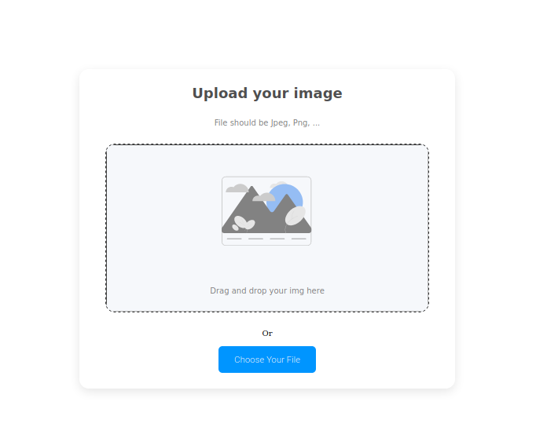
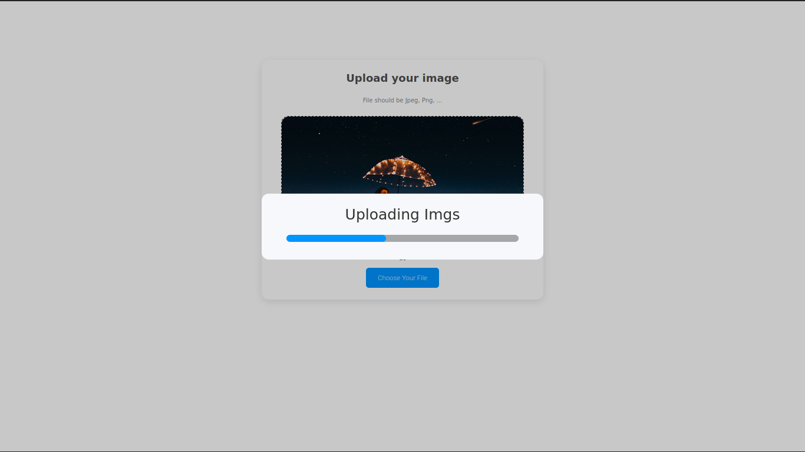
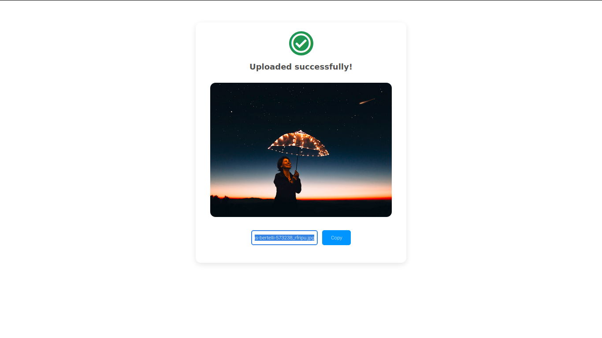

<!-- Please update value in the {}  -->

<h1 align="center"><a href="https://secret-waters-42028.herokuapp.com">Img Uploader</a></h1>

  <h3>
    <a href="https://secret-waters-42028.herokuapp.com">
      Demo
    </a>
     | 
    <a href="https://github.com/EufranioDiogo/ImgUploader">
      Solution
    </a>
  </h3>

This is a project that allow you put a image uploaded at the internet and get a link to access it anytime.

## Table of Contents

- [Table of Contents](#table-of-contents)
- [Overview](#overview)
  - [Built With](#built-with)
- [Contact](#contact)

## Overview

- Where can I see your demo? 
  [Here](https://secret-waters-42028.herokuapp.com)
- What was your experience? 
  It is my first full-stack challenge that I did, and my experience was not so easy but I loved because I learned a lot of things.
- What have you learned/improved? 
  I learned how to work with express, multer, routes and deploies.

### Built With

<!-- This section should list any major frameworks that you built your project using. Here are a few examples.-->

- Node.js
- Express
- Multer
- JS
- EJS
- HTML
- CSS

## Contact

- [Website](https://eufraniodiogo.github.io)
- [GitHub](https://github.com/EufranioDiogo)
- Email: eufraniodiogo5@gmail.com
